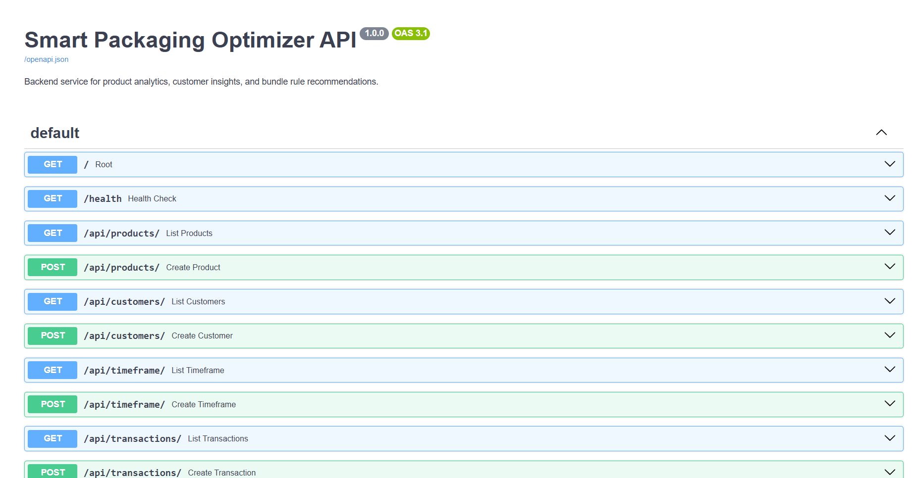
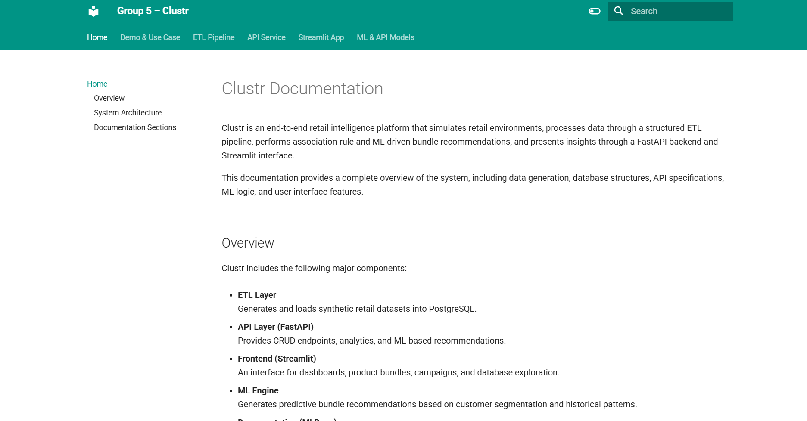

# Clustr – Intelligent Product Bundling & Retail Insights Platform

Clustr is an end-to-end analytics ecosystem designed to simulate retail environments, process transactional data, generate product bundle recommendations (association-rule + ML), and present insights through a clean Streamlit interface.  
It includes an ETL pipeline, FastAPI backend, PostgreSQL database, ML engine, and MkDocs documentation.

This README provides installation steps, run instructions, platform links, and screenshots integrated throughout the document.

---

## Documentation

Local documentation (MkDocs):

    http://127.0.0.1:8000

Run using:

    python -m mkdocs serve

---

## Platform Links (Local Development)

Streamlit UI:

    http://localhost:8501

FastAPI Root:

    http://127.0.0.1:8008

FastAPI Swagger Docs:

    http://127.0.0.1:8008/docs

pgAdmin (if configured in Docker):

    http://localhost:5050

---

## Project Structure

myapp/
├── api/                  # FastAPI backend  
├── app/                  # Streamlit UI  
├── etl/                  # ETL pipeline + data generator  
├── ml/                   # Machine learning engine  
├── pgadmin_data/         # pgAdmin storage (Docker)  
├── .env                  # Environment variables  
├── docker                # Dockerfile (rename recommended)  
├── docker-compose        # Docker Compose config  
└── README.md             # App-level instructions  

---

## Features

### ETL & Data
- Synthetic dataset generation  
- Loading into PostgreSQL  
- Association-rule bundle generation  

### API (FastAPI)
- CRUD endpoints  
- ML recommendation endpoint  
- Association-rule bundles  
- Automatic Swagger documentation  

### Streamlit Application
- KPI dashboard  
- Database browser  
- Bundle explorer (association rules + ML recommendations)  
- Campaign builder (turns bundles into actionable marketing ideas such as messaging, segment targeting, and channel selection)  
- Settings page  

### ML Engine
- Predictive scoring of product bundles  
- Demographic segmentation filters  

---

## Installation

Install dependencies:

    pip install -r requirements.txt

---

## Running the System

### Step 1 — Run ETL

    python etl/etl_process.py

This step:
- Generates synthetic data  
- Creates tables  
- Loads CSVs  
- Generates association rules  
- Populates `bundle_rules`  

---

### Step 2 — Start FastAPI Backend

    uvicorn api.main:app --reload

FastAPI:

    http://127.0.0.1:8008

Swagger:

    http://127.0.0.1:8008/docs

Swagger preview:  

---

### Step 3 — Launch Streamlit UI

    streamlit run app/app.py

Then open:

    http://localhost:8501

Dashboard preview:  

Bundle Recommendations preview:  

Campaign Builder is accessible from the sidebar inside Streamlit.

---

### Step 4 — Run MkDocs Documentation

    python -m mkdocs serve

Open:

    http://127.0.0.1:8000

Documentation preview:  

---

## PostgreSQL Access (Optional)

If pgAdmin is running:

    http://localhost:5051

Tables include:

- products  
- customers  
- timeframe  
- transactions  
- sales  
- bundle_rules  

pgAdmin preview:  

---

## Contribution Guide

1. Fork the repository  
2. Create a new branch  
3. Commit changes  
4. Open a pull request  

Documentation changes must also update the `docs/` folder.

---

## Maintainers

Clustr is developed by:

**Group 5 – Marketing Analytics**

Team:

1. Kima Badalyan (Product Manager)  
2. Gor Yeghiazaryan (Backend and Frontend Developer)  
3. Norayr Amirkhanyan (Data Scientist)  
4. Liza Khachatryan (DB Developer)

Superviser: Karen Hovhannisyan
